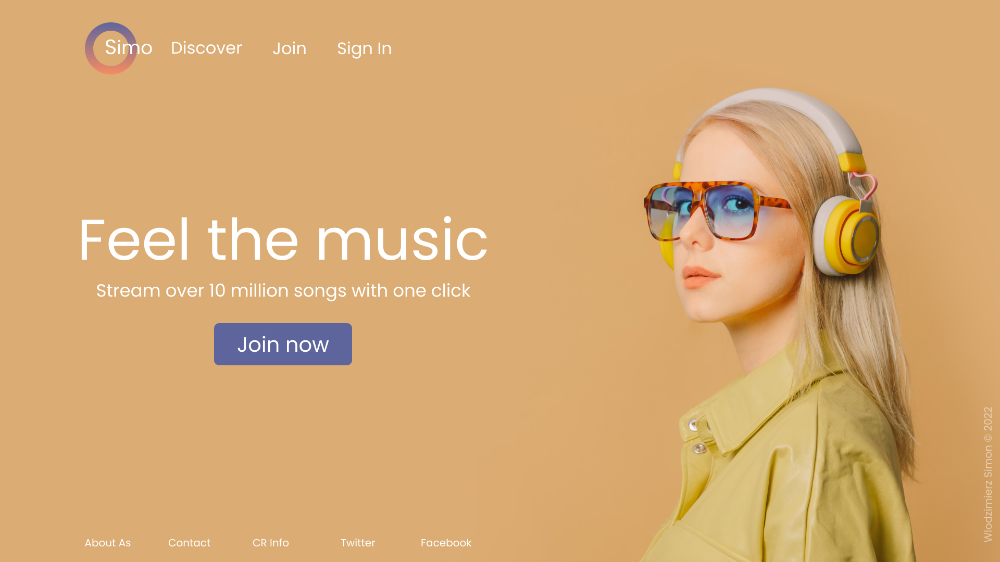
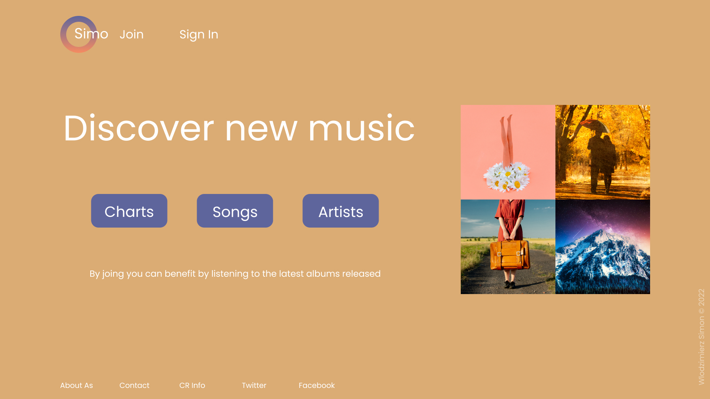
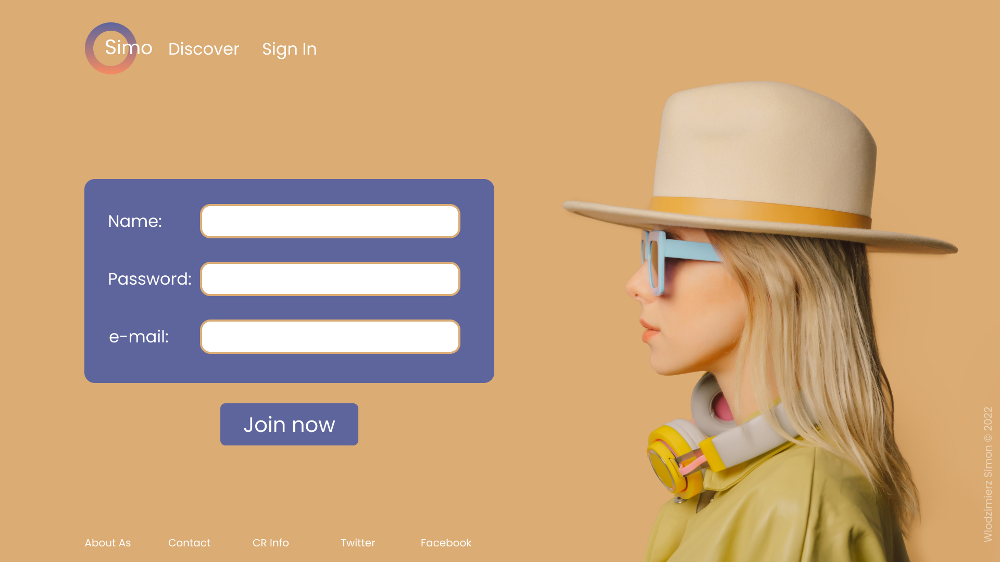

# Hometask Music Landing Page

## Task descrition

You task is to implement Figma design using DOM API only. The main goal is to implement it close to design, not pixel-perfect.

In this task you need to implement three pages (Landing, Feature and Sign up). On each page there are several text elements in header component and on a page. Clicking on each text elements should render a new page (render means instead of current page a new page is being displayed) (see more in Evaluation criteria section below).

Please be flexible and do not stick completly to design in these cases:

- Font used in Figma is a paid or not available on the internet - try to replace it with a font you would like to. The best practice is just to used standard fonts like Roboto
- Figma elements' dimenstion specified in:
  - real numbers (44.21) --> round to closest odd number (46 or 44)
  - even number (11, 67) --> round to closes odd number or to the closes pow of 2 (12, 64)
  - visually margins left and right are equal to each other, but in numbers they are i.e 51 and 49. Choose one value, better odd number (24, 12, etc)

## Evaluation criteria - HR Students

Maximum score - **10** consists of:

- Render "Landing page" using DOM API only - **1**
- Render "Feature page" using DOM API only - **1**
- Render "Sign up page" using DOM API only - **1**
- Handle clicks on header/footer elements and rerender pages:
  - On "Landing page" - **2**
    - [ ] Click on "Discover" text in Header renders "Feature page"
    - [ ] Click on "Join" text in Header and on "Join now" button on a page renders "Sign up page"
  - On "Feature page" - **2**
    - [ ] Click on "Join" text in Header renders "Sign up page"
  - On "Sign up page" - **1**
    - [ ] Click on "Discover" text in Header renders "Landing page"
  - **Note**: Footer components is the same for all pages. Might be not needed to rerender every time but render only once?
  - **Note**: Header components could also be reusable but not complete, only one part - array of text elements near a logo. Only they are differ from page to page. Logo is always the same.
- Use [BEM](https://en.bem.info/methodology/) - **1**
- On a screen with any height either desktop layout should be visible fully without vertical scrolling - **1**
  - **Note**: Because you are using different laptops with different screen height, please don't stick to Figma height distance between elements. Try to use flexible units like <i>%</i> or <i>vh</i> instead of px. Or just use flexbox containers which adjust dynamic height/width between elements. Example: in Figma on "Landing page" you found out that distance between "Feel the music" title and "Simo" logo in header is 420px. Instead of setting margin-top: 420px for "Feel the music" title, please wrap title in flexbox container with a min-height: 80vh; flex-direction: column; and align-items: center;. In that case flexbox container will be placed between header and footer and title will be exactly in center of a screen (like it is in Figma).

## Evaluation criteria - LR Students

Maximum score - **10** consists of:

- Render "Landing page" using DOM API only - **2**
- Render "Feature page" using DOM API only - **2**
- Render "Sign up page" using DOM API only - **2**
- Handle clicks on header/footer elements and rerender pages:
  - On "Landing page" - **2**
    - [ ] Click on "Discover" text in Header renders "Feature page"
    - [ ] Click on "Join" text in Header and on "Join now" button on a page renders "Sign up page"
  - On "Feature page" - **1**
    - [ ] Click on "Join" text in Header renders "Sign up page"
  - On "Sign up page" - **1**
    - [ ] Click on "Discover" text in Header renders "Landing page"
  - **Note**: Footer components is the same for all pages. Might be not needed to rerender every time but render only once?
  - **Note**: Header components could also be reusable but not complete, only one part - array of text elements near a logo. Only they are differ from page to page. Logo is always the same.

## Figma design link

[Figma design link is here](<https://www.figma.com/file/jBupss732smLvocCX0UL9G/Music-Site-(Community)>)

## Image design

Click to display final design (Landing Page)

Click to display final design (Feature Page)

Click to display final design (Sign up Page)

## Project structure

`index.html` - contains HTML code

`assets/design` - contains final design template

`assets/images` - contains images

`assets/icons` - contains icons

`styles` - contains CSS code

## How to run

### Running by simply opening index.html in browser

- Open file `index.html` on browser
  - In Visual Studio Code right click in index.html -> Copy Path
  - Open browser and paste copied path as an url (i.e `D://Proejcts/intro-to-web-dev-tasks/packages/classtask-YuliaVorman/index.html`)
- Enjoy

Why not to use that approach - every time you're making changes you have to reload your page manually

Why to use - simply you don't want to deal with NPM and JavaScript or there might be any issues currently with it

### Running using NPM and JavaScript (Preferred)

- Open console
- In console navigate to the project root (`./intro-to-web-dev-tasks`)
- Run `npm install`
- Navigate to the project `cd packages/classtask-YuliaVorman`
- Run `npm run serve`
- Open browser
- Navigate to `http://localhost:8080/`
- Enjoy

Why to use - every time you make a change your page is automatically reloaded and your changes applied

Why not to use - you don't want to deal with NPM and JavaScript or there might be any issues currently with it
